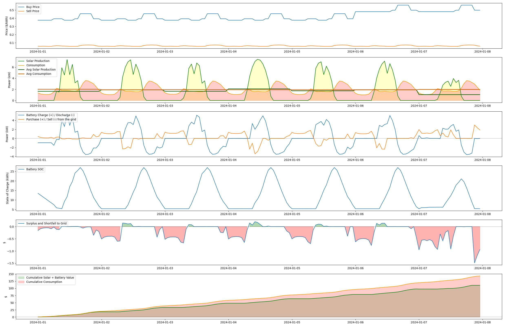

# Smart Grid Energy Management System

This project develops an intelligent energy management system for a residential smart grid equipped with solar panels and battery storage, utilizing Model Predictive Control (MPC). The system strategically optimizes energy costs by determining the optimal times to buy, sell, or store energy, based on real-time data and future predictions.

Below is an example of the optimal control generated by the smart grid energy management system:

## System Components

### 1. Solar Production (`solar_simulator.py`)
- Simulates solar panel energy production
- Uses real historical data from San Diego
- Falls back to a bell curve model when historical data isn't available
- Accounts for time of day, month, and seasonal variations

### 2. Consumption Simulator (`consumption_simulator.py`)
- Simulates residential energy consumption patterns
- Models daily usage variations:
  - Morning peak (breakfast time)
  - Evening peak (dinner time)
  - Lower usage during mid-day
  - Base load for always-on appliances
- Accounts for:
  - Time of day effects
  - Weekday vs weekend patterns
  - Seasonal variations
- Provides realistic consumption forecasts for optimization

### 3. Price Forecast (`price_forecast.py`)
- Predicts electricity prices for future time periods
- Features:
  - Time-of-use pricing patterns
  - Peak/off-peak rate differentiation
  - Dynamic price variations
  - Historical price analysis
- Considers:
  - Time of day impact
  - Day of week patterns
  - Seasonal trends
  - Grid demand levels
- Provides price forecasts for optimization decisions

### 4. Model Predictive Control (`smart_grid_mpc.py`)
- Advanced optimization using Model Predictive Control
- Features:
  - Rolling horizon optimization
  - Multi-period planning
  - Constraint handling
  - Real-time adaptation
- Optimizes for:
  - Cost minimization
  - Battery lifecycle
  - Grid constraints
  - Demand satisfaction
- Handles:
  - System dynamics
  - Operational constraints
  - Uncertainty in predictions
  - Multiple time scales

## Key Features

- Battery Management
  - Respects battery capacity limits
  - Maintains minimum charge levels
  - Controls charging/discharging rates
  - Optimizes battery usage based on price patterns

- Grid Integration
  - Buys electricity during low-price periods
  - Sells excess energy during high-price periods
  - Respects grid connection ampacity limits
  - Ensures reliable home power supply

- Solar Integration
  - Uses historical solar production data
  - Accounts for weather and seasonal variations
  - Optimizes use of solar energy production

## System Constraints

- Battery Constraints
   - Maximum capacity per battery: 13.5 kWh
   - Minimum charge level: 20%
   - Maximum charge/discharge rate: 12 kW

- Grid Constraints
   - Maximum power transfer rate (ampacity)
   - Grid connection limitations

- Consumption Requirements
   - Home energy demand must always be met
   - Prioritizes reliable power supply

## Model Predictive Control (MPC) Formulation

- Sets and Indices
  - $t \in \{1,\ldots,T\}$: Time steps in the prediction horizon
  - $T$: Length of prediction horizon (24 hours)

- Parameters
  - $p_t^b$: Electricity buying price at time $t$ [$/kWh]
  - $p_t^s$: Electricity selling price at time $t$ [$/kWh]
  - $s_t$: Solar power production at time $t$ [kW]
  - $d_t$: Home power consumption at time $t$ [kW]
  - $C$: Battery capacity [kWh]
  - $C_{min}$: Minimum battery state of charge ($0.2C$) [kWh]
  - $r_{max}^c$: Maximum battery charging rate [kW]
  - $r_{max}^d$: Maximum battery discharging rate [kW]
  - $\eta$: Battery charging/discharging efficiency (0.95)
  - $A$: Grid connection ampacity limit [kW]
  - $SoC_0$: Initial battery state of charge [kWh]

- Decision Variables
  - $b_t$: Battery power flow at time $t$ [kW]
    - $b_t > 0$: charging
    - $b_t < 0$: discharging
  - $g_t$: Grid power flow at time $t$ [kW]
    - $g_t > 0$: buying
    - $g_t < 0$: selling

- State Variables
  - $SoC_t$: Battery state of charge at time $t$ [kWh]

- Objective Function
  - Maximize profit (minimize negative profit):
    $$\min_{b_t,g_t} \sum_{t=1}^T \left(g_t^+ p_t^b - g_t^- p_t^s\right)$$
    where:
      - $g_t^+ = \max(g_t, 0)$: Power bought from grid
      - $g_t^- = \max(-g_t, 0)$: Power sold to grid

- Constraints

  - Power Balance Constraint:
     $$d_t = s_t - b_t + g_t \quad \forall t$$

  - Battery State of Charge Evolution:
    - For charging ($b_t \geq 0$):
       $$SoC_{t+1} = SoC_t + b_t\eta \quad \forall t$$

    - For discharging ($b_t < 0$):
       $$SoC_{t+1} = SoC_t + \frac{b_t}{\eta} \quad \forall t$$

  - Battery Capacity Constraints:
     $$C_{min} \leq SoC_t \leq C \quad \forall t$$

  - Battery Power Flow Limits:
     $$-r_{max}^d \leq b_t \leq r_{max}^c \quad \forall t$$

  - Grid Power Flow Limits:
     $$-A \leq g_t \leq A \quad \forall t$$

  - Initial Condition:
     $$SoC_1 = SoC_0$$

## Usage

- Tune the parameters in config.py
   - mode = 'mid_prod'  # total production = total consumption
   - n_day = 366  # number of days to simulate
   - n_day_figure = 1  # number of days to plot
   - use_battery = True  # whether to use battery
   - n_battery = 2  # number of batteries

- run smart_grid_mpc.py to generate results

- run plot_stat.py to plot figures
